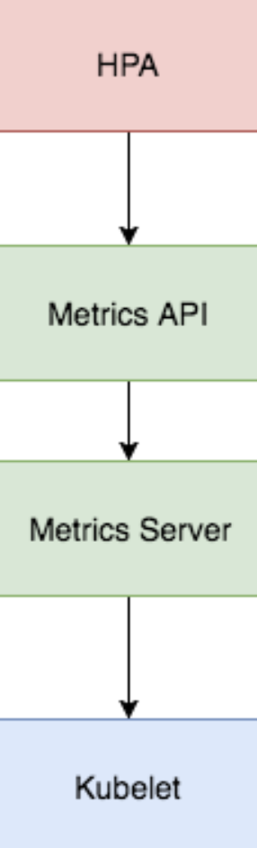

## Horizonal Pod Auoscler (HPA)

The HPA monitors the metrics of the K8S, change the number of replicas and scales the number of pods.

Horizontal Pod Autoscaler is a type of autoscaler that can increase or decrease the number of pods in a Deployment, ReplicationController, StatefulSet, or ReplicaSet, usually in response to CPU utilization patterns. This process represents horizontal scaling because it changes the number of instances, not the resources allocated to a given container.

## Vertical Pod Auoscler (VPA)

The HPA monitors the K8S metrics and change the pod CPU and Memory values.

## Cluster Autoscaler (CA)

 The CA adding nodes and use the k8s scheduler to spread the pods between the nodes.

# HPA cares about improving the performance of your application, VPA cares about the performance of the cluster.

 ### Install HPA / Metrics

 # Setting up the Metrics Server
The Kubernetes Metrics Server is a cluster-wide aggregator of resource usage data and is the successor of Heapster. The metrics server collects CPU and memory usage for nodes and pods by pooling data from the kubernetes.summary_api. The summary API is a memory-efficient API for passing data from Kubelet/cAdvisor to the metrics server.

kubectl apply -f https://github.com/kubernetes-sigs/metrics-server/releases/latest/download/components.yaml

kubectl get deployment metrics-server -n kube-system

NAME             READY   UP-TO-DATE   AVAILABLE   AGE
metrics-server   1/1     1            1           6m

# Install HPA

kubectl create -f ./podinfo/podinfo-hpa.yaml

kubectl get hpa

NAME      REFERENCE            TARGETS                      MINPODS   MAXPODS   REPLICAS   AGE
podinfo   Deployment/podinfo   2826240 / 200Mi, 15% / 80%   2         10        2          5m

In order to increase the CPU usage, run a load test with rakyll/hey:

#install hey
https://github.com/rakyll/hey

#do 10K requests
hey -n 10000 -q 10 -c 5 http://<K8S_PUBLIC_IP>:31198/

NAME      REFERENCE            TARGETS                       MINPODS   MAXPODS   REPLICAS   AGE
podinfo   Deployment/podinfo   5012684800m/200Mi, 100%/80%   2         10        10         12m

- Remove podinfo

kubectl delete -f ./podinfo/podinfo-hpa.yaml,./podinfo/podinfo-dep.yaml,./podinfo/podinfo-svc.yaml
