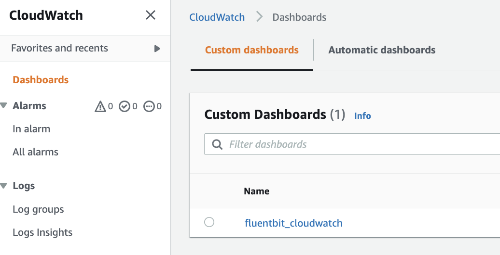
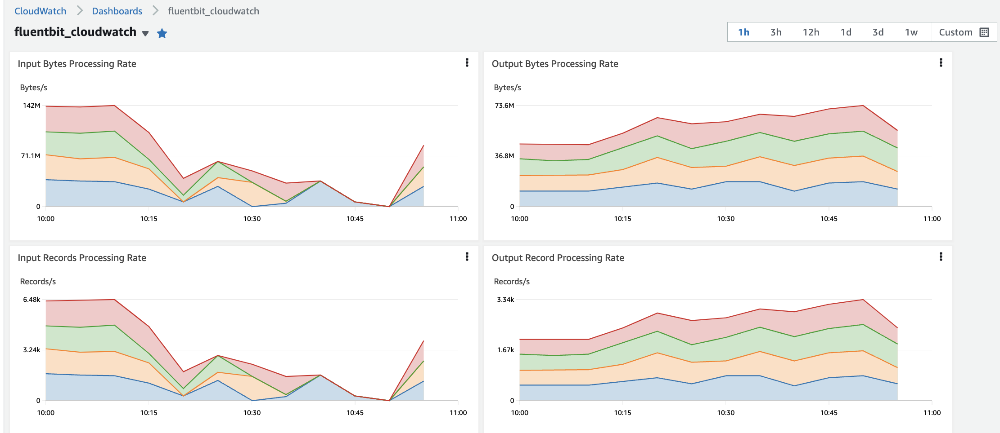
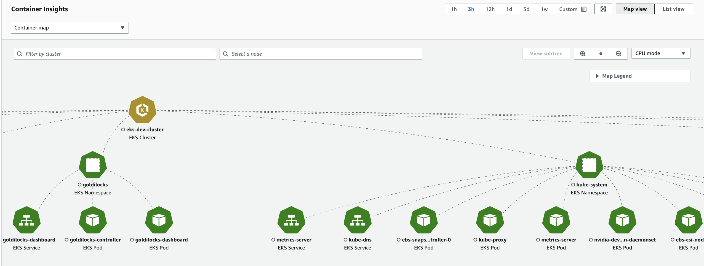
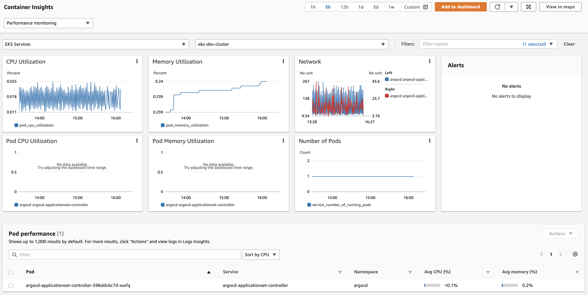

### Fluent Bit Integration in CloudWatch Container Insights for EKS


## Introduction to Fluent Bit
Fluent Bit is an open source and multi-platform log processor and forwarder that allows you to collect data and logs from different sources, and unify and send them to different destinations including CloudWatch Logs. It’s also fully compatible with Docker and Kubernetes environments. Using the newly launched Fluent Bit daemonset, you can send container logs from your EKS clusters to CloudWatch logs for logs storage and analytics.

Due to its lightweight nature, using Fluent Bit as the default log forwarder in Container Insights on EKS worker nodes will allow you to stream application logs into CloudWatch logs efficiently and reliably. With Fluent Bit, Container Insights is able to deliver thousands of business critical logs at scale in a resource efficient manner, especially in terms of CPU and memory utilization at the pod level. In other words, compared to FluentD, which was the log forwarder used prior, Fluent Bit has a smaller resource footprint and, as a result, is more resource efficient for memory and CPU. On the other hand, AWS for Fluent Bit image, which includes Fluent Bit and related plugins, gives Fluent Bit an additional flexibility of adopting new AWS features faster as the image aims to provide a unified experience within AWS ecosystem.

## Multiple log input streams into CloudWatch logs
While working with containers, it is recommended to push all the logs, including application logs, through the standard output (stdout) and standard error output (stderr) methods whenever possible using the Docker JSON logging driver. For this reason, in EKS, the Docker JSON logging driver is configured by default and everything that a containerized application writes to stdout or stderr is streamed into a JSON file under “/var/log/containers" on the worker node. Container Insights classifies those logs into three different categories by default and creates dedicated input streams for each category within Fluent Bit and independent log groups within CloudWatch Logs. Those categories are:

Application logs: All applications logs stored under “/var/log/containers/*.log" are streamed into the dedicated /aws/containerinsights/Cluster_Name/application log group. All non-application logs such as kube-proxy and aws-node logs are excluded by default. However, additional Kubernetes add-on logs, such as CoreDNS logs, are also processed and streamed into this log group.
Host logs: system logs for each EKS worker node are streamed into the /aws/containerinsights/Cluster_Name/host log group. These system logs include the contents of “/var/log/messages,/var/log/dmesg,/var/log/secure” files. Considering the stateless and dynamic nature of containerized workloads, where EKS worker nodes are often being terminated during scaling activities, streaming those logs in real time with Fluent Bit and having those logs available in CloudWatch logs, even after the node is terminated, are critical in terms of observability and monitoring health of EKS worker nodes. It also enables you to debug or troubleshoot cluster issues without logging into worker nodes in many cases and analyze these logs in more systematic way.
Data plane logs: EKS already provides control plane logs. With Fluent Bit integration in Container Insights, the logs generated by EKS data plane components, which run on every worker node and are responsible for maintaining running pods are captured as data plane logs. These logs are also streamed into a dedicated CloudWatch log group under ‘ /aws/containerinsights/Cluster_Name/dataplane. kube-proxy, aws-node, and Docker runtime logs are saved into this log group. In addition to control plane logs, having data plane logs stored in CloudWatch Logs helps to provide a complete picture of your EKS clusters.
The architecture below shows individual components used by CloudWatch Container Insights for EKS:


### Install the CloudWatch agent with Prometheus metrics collection on Amazon EKS and Kubernetes clusters

This section explains how to set up the CloudWatch agent with Prometheus monitoring in a cluster running Amazon EKS or Kubernetes. After you do this, the agent automatically scrapes and imports metrics for the following workloads running in that cluster.

Amazon App Mesh

NGINX

Memcached

Java/JMX

HAProxy

Fluent Bit

You can also configure the agent to scrape and import additional Prometheus workloads and sources.

Before following these steps to install the CloudWatch agent for Prometheus metric collection, you must have a cluster running on Amazon EKS or a Kubernetes cluster running on an Amazon EC2 instance.

# VPC security group requirements
The ingress rules of the security groups for the Prometheus workloads must open the Prometheus ports to the CloudWatch agent for scraping the Prometheus metrics by the private IP.

The egress rules of the security group for the CloudWatch agent must allow the CloudWatch agent to connect to the Prometheus workloads' port by private IP.

# Setting up IAM roles
The first step is to set up the necessary IAM role in the cluster. There are two methods:

* Set up an IAM role for a service account, also known as a service role. This method works for both the EC2 launch type and the Fargate launch type.

* Add an IAM policy to the IAM role used for the cluster. This works only for the EC2 launch type.

# Set up a service role (EC2 launch type and Fargate launch type)

To set up a service role, enter the following command. Replace MyCluster with the name of the cluster.

eksctl create iamserviceaccount \
 --name cwagent-prometheus \
--namespace amazon-cloudwatch \
 --cluster MyCluster \
--attach-policy-arn arn:aws:iam::aws:policy/CloudWatchAgentServerPolicy \
--approve \
--override-existing-serviceaccounts

# Add a policy to the cluster's IAM role (EC2 launch type only)
# To set up the IAM policy in a cluster for Prometheus support
1. Open the Amazon EC2 console at [https://console.amazonaws.cn/ec2/]
2. In the navigation pane, choose Instances.
3. You need to find the prefix of the IAM role name for the cluster. To do this, select the check box next to the name of an instance that is in the cluster, and choose Actions, Instance Settings, Attach/Replace IAM Role. Then copy the prefix of the IAM role, such as eksctl-dev303-workshop-nodegroup.
4. Open the IAM console at https://console.amazonaws.cn/iam/.
5. In the navigation pane, choose Roles.
6. Use the search box to find the prefix that you copied earlier in this procedure, and choose that role.
7. Choose Attach policies.
8. Use the search box to find CloudWatchAgentServerPolicy. Select the check box next to CloudWatchAgentServerPolicy, and choose Attach policy.

## Installing the CloudWatch agent to collect Prometheus metrics
You must install the CloudWatch agent in the cluster to collect the metrics. How to install the agent differs for Amazon EKS clusters and Kubernetes clusters.

# To install the CloudWatch agent with Prometheus support on an Amazon EKS cluster
1. Enter the following command to check whether the amazon-cloudwatch namespace has already been created:
```
kubectl get namespace amazon-cloudwatch
```
2. If amazon-cloudwatch is not displayed in the results, create it by entering the following command:
```
kubectl create namespace amazon-cloudwatch
```
3. Download the YAML file for the agent by entering the following command:
```
curl -O https://raw.githubusercontent.com/aws-samples/amazon-cloudwatch-container-insights/latest/k8s-deployment-manifest-templates/deployment-mode/service/cwagent-prometheus/prometheus-eks.yaml
```
4. Open the file with a text editor, and search for the cwagentconfig.json block of the file.
5. Add the highlighted lines, specifying the Region that you want:
```
cwagentconfig.json: |
    {
      "agent": {
        "region": "eu-west-1"
      },
      "logs": { ...

```
6. Save the file and deploy the agent using your updated file.
```
kubectl apply -f prometheus-eks.yaml
```
7. Verify the pod is running
```
kubectl get pod -l "app=cwagent-prometheus" -n amazon-cloudwatch
```
```
NAME                                  READY   STATUS    RESTARTS   AGE
cwagent-prometheus-66c7cb5588-w72mc   1/1     Running   0          69s
```

## Continue FluentBit installation
1. Create environment variables, replacing the values below to match your deployment.
```
DASHBOARD_NAME=fluentbit_cloudwatch
REGION_NAME=eu-west-1
CLUSTER_NAME=your_kubernetes_cluster_name
```

2. Enter the following command to create the dashboard.
```
curl https://raw.githubusercontent.com/aws-samples/amazon-cloudwatch-container-insights/latest/k8s-deployment-manifest-templates/deployment-mode/service/cwagent-prometheus/sample_cloudwatch_dashboards/fluent-bit/cw_dashboard_fluent_bit.json \
| sed "s/{{YOUR_AWS_REGION}}/${REGION_NAME}/g" \
| sed "s/{{YOUR_CLUSTER_NAME}}/${CLUSTER_NAME}/g" \
| xargs -0 aws cloudwatch put-dashboard --dashboard-name ${DASHBOARD_NAME} --dashboard-body
```


curl https://raw.githubusercontent.com/aws-samples/amazon-cloudwatch-container-insights/latest/k8s-deployment-manifest-templates/deployment-mode/service/cwagent-prometheus/prometheus-k8s.yaml | 
sed "s/{{cluster_name}}/eks-dev-cluster/;s/{{region_name}}/eu-west-1/" | 
kubectl apply -f 

# Add CloudWatch Container Insights

## Configure your environment variables
ClusterName='MyCluster'
LogRegion='REGION'
FluentBitHttpPort='2020'
FluentBitReadFromHead='Off'
[[ ${FluentBitReadFromHead} = 'On' ]] && FluentBitReadFromTail='Off'|| FluentBitReadFromTail='On'
[[ -z ${FluentBitHttpPort} ]] && FluentBitHttpServer='Off' || FluentBitHttpServer='On'

## Install CloudWatch agent with FluentBit metrics
```
curl https://raw.githubusercontent.com/aws-samples/amazon-cloudwatch-container-insights/latest/k8s-deployment-manifest-templates/deployment-mode/daemonset/container-insights-monitoring/quickstart/cwagent-fluent-bit-quickstart.yaml | sed 's/{{cluster_name}}/'${ClusterName}'/;s/{{region_name}}/'${LogRegion}'/;s/{{http_server_toggle}}/"'${FluentBitHttpServer}'"/;s/{{http_server_port}}/"'${FluentBitHttpPort}'"/;s/{{read_from_head}}/"'${FluentBitReadFromHead}'"/;s/{{read_from_tail}}/"'${FluentBitReadFromTail}'"/' | kubectl apply -f - 
```

## Add CloudWatch ServiceAccount
```
kubectl apply -f https://raw.githubusercontent.com/aws-samples/amazon-cloudwatch-container-insights/latest/k8s-deployment-manifest-templates/deployment-mode/daemonset/container-insights-monitoring/cwagent/cwagent-serviceaccount.yaml
```

## Configure metrics parameters for CloudWatch using ConfigMap
```
curl -O https://raw.githubusercontent.com/aws-samples/amazon-cloudwatch-container-insights/latest/k8s-deployment-manifest-templates/deployment-mode/daemonset/container-insights-monitoring/cwagent/cwagent-configmap.yaml
```

Edit cwagent-configmap.yaml file
```
kubectl apply -f cwagent-configmap.yaml
```

## Results:


* EKS Pods MAP


* Pod Insights
