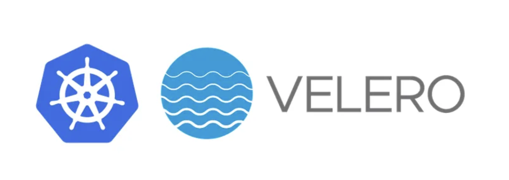
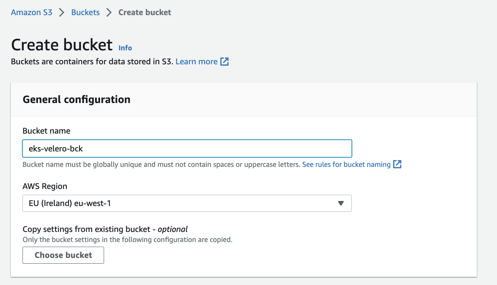
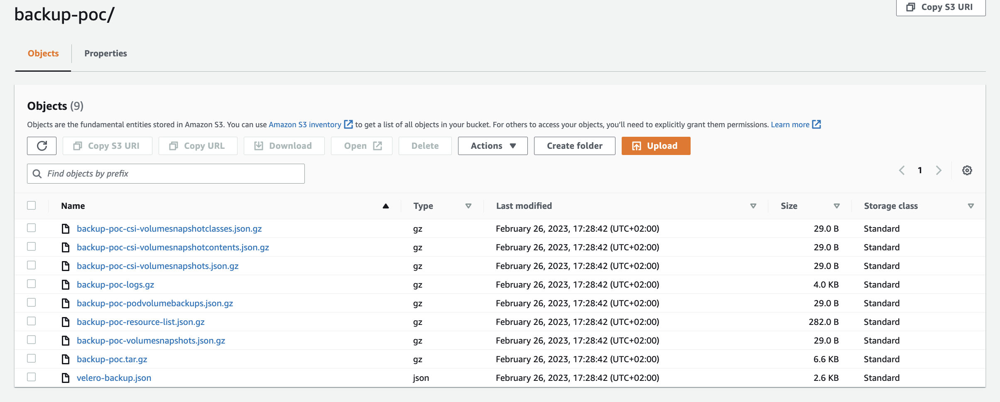

### K8S Backup by Velero

Velero is an open-source tool that helps automate the backup and restore of Kubernetes clusters, including any application and its data.

Velero lets you backup your entire cluster or namespace(s) or filter objects by using labels. Velero helps with migrating your on-prem Kubernetes workloads to the cloud, cluster upgrades, and disaster recovery.

Velero enables the following use cases:

Disaster recovery — backup of the cluster and restore in case of a disaster.
Application migration — migrate an application along with its data from one cluster to another.
Application cloning — replicating production environments for testing and debugging.
In this module, you will learn the below things:

1. how to backup and restore an EKS cluster using Velero.

2. how to backup and restore data on 2 different EKS Cluster.

3. how to backup and restore the data at a particular time(Scheduled backup and restore)

Let’s start:
Prerequisites

AWS CLI needs to be configured in the machine where you execute Velero commands.
Kubectl needs to be configured with the EKS cluster where you need to take the backup.
1. CREATE S3 BUCKET AND IAM USER FOR VELERO
Create the S3 bucket using AWS console.
go to AWS -> S3-> create bucket

2. Create an IAM user or use an EC2 IAM role

3. Add the below permission to the user.

replace ${BUCKET} with S3 bucket name which we created for velero.

{
    "Version": "2012-10-17",
    "Statement": [
        {
            "Effect": "Allow",
            "Action": [
                "ec2:DescribeVolumes",
                "ec2:DescribeSnapshots",
                "ec2:CreateTags",
                "ec2:CreateVolume",
                "ec2:CreateSnapshot",
                "ec2:DeleteSnapshot"
            ],
            "Resource": "*"
        },
        {
            "Effect": "Allow",
            "Action": [
                "s3:GetObject",
                "s3:DeleteObject",
                "s3:PutObject",
                "s3:AbortMultipartUpload",
                "s3:ListMultipartUploadParts"
            ],
            "Resource": [
                "arn:aws:s3:::${VELERO_BUCKET}/*"
            ]
        },
        {
            "Effect": "Allow",
            "Action": [
                "s3:ListBucket"
            ],
            "Resource": [
                "arn:aws:s3:::${VELERO_BUCKET}"
            ]
        }
    ]
}

2. INSTALL VELERO Client
Install Velero binary

wget https://github.com/vmware-tanzu/velero/releases/download/v1.7.2/velero-v1.7.2-linux-amd64.tar.gz
Extract the tarball:

tar -xvf velero-v1.7.2-linux-amd64.tar.gz -C /tmp
Move the extracted velero binary to /usr/local/bin

sudo mv /tmp/velero-v1.7.2-linux-amd64/velero /usr/local/bin
Verify installation

velero version
output:

Client:         Version: v1.7.2         Git commit: 55a9914a3e4719fb1578529c45430a8c11c28145 <error getting server version: the server could not find the requested resource (post serverstatusrequests.velero.io)>

3. Install Velero on EKS
velero install \
    --provider aws \
    --plugins velero/velero-plugin-for-aws:v1.4.0 \
    --bucket <bucketname>\
    --backup-location-config region=<region> \
    --snapshot-location-config region=<region> \
    --secret-file ./credentials
replace your bucket name, region, and credentials path in the command.

E.X:

velero install \
    --provider aws \
    --plugins velero/velero-plugin-for-aws:v1.0.1 \
    --bucket eks-velero-bck \
    --backup-location-config region=eu-west-1 \
    --snapshot-location-config region=eu-west-1 \
    --secret-file ./credentials
Note:- Most Probably you get error during install something like This :- “Error installing Velero. Use `kubectl logs deploy/velero -n velero` to check the deploy logs: Error creating resource CustomResourceDefinition/backups.velero.io: the server could not find the requested resource”,
It get resolved by velero cli version and plugin version.

Inspect the resources created

kubectl get all -n velero

NAME                          READY   STATUS    RESTARTS   AGE
pod/velero-58b9bf7b8d-99cfs   1/1     Running   0          32s

NAME                     READY   UP-TO-DATE   AVAILABLE   AGE
deployment.apps/velero   1/1     1            1           37s

NAME                                DESIRED   CURRENT   READY   AGE
replicaset.apps/velero-58b9bf7b8d   1         1         1       38s

4. DEPLOY TEST APPLICATION
Create namespace and deploy the application

kubectl create namespace <namespacename>
EX:- kubectl create namespace backup-poc
Deploy 2 sample applications in the hardik namespace.

kubectl create deployment web --image=gcr.io/google-samples/hello-app:1.0 -n backup-poc
kubectl create deployment nginx --image=nginx -n backup-poc

# Verify deployment

kubectl get deployments -n backup-poc

5. BACKUP AND RESTORE
Let’s back up the backup-poc namespace using velero

# backup:

velero backup create <backupname> --include-namespaces <namespacename>
EX:- velero backup create backup-poc --include-namespaces backup-poc
Check the status of backup

velero backup describe <backupname>
Check-in S3 bucket :

backup is stored in the S3 bucket.

Let’s delete the backup-poc namespace to simulate a disaster

kubectl delete namespace backup-poc

Restore:

Run the velero restore command from the backup created. It may take a couple of minutes to restore the namespace.

velero restore create --from-backup <backupname>
EX:- velero restore create --from-backup backup-poc
Verify if deployments, replica sets, services, and pods are restored.

Here are some useful commands for velero :
Backup:
# Create a backup every 6 hours with the @every notation
velero schedule create <SCHEDULE_NAME> --schedule="@every 6h"
# Create a daily backup of the namespace
velero schedule create <SCHEDULE_NAME> --schedule="@every 24h" --include-namespaces <namspacename>
# Create a weekly backup, each living for 90 days (2160 hours)
velero schedule create <SCHEDULE_NAME> --schedule="@every 168h" --ttl 2160h0m0s     
##default TTL time is 720h
# Create a backup including the test and default namespaces
velero backup create backup --include-namespaces test,default
# Create a backup excluding the kube-system and default namespaces
velero backup create backup --exclude-namespaces kube-system,default
# To backup entire cluster
velero backup create <BACKUPNAME>
#To backup namespace in a cluster
velero backup create <BACKUPNAME> --include-namespaces <NAMESPACENAME>
Restore:
#Manual Restore
velero restore create --from-backup <backupname>
#Scheduled Backup
velero restore create <RESTORE_NAME> --from-schedule <SCHEDULE_NAME>
# Create a restore including the test and default namespaces
velero restore create --from-backup backup --include-namespaces nginx,default
# Create a restore excluding the kube-system and default namespaces
velero restore create --from-backup backup --exclude-namespaces kube-system,default
#Retrieve restore logs
velero restore logs <RESTORE_NAME>
Reference:- https://github.com/vmware-tanzu/velero-plugin-for-aws/blob/main/README.md

