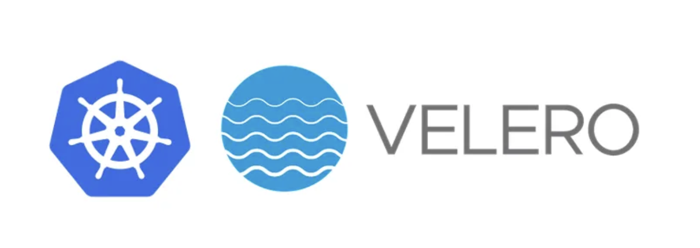

### K8S Backup by Velero

Velero is an open-source tool that helps automate the backup and restore of Kubernetes clusters, including any application and its data.

Velero lets you backup your entire cluster or namespace(s) or filter objects by using labels. Velero helps with migrating your on-prem Kubernetes workloads to the cloud, cluster upgrades, and disaster recovery.

Velero enables the following use cases:

Disaster recovery — backup of the cluster and restore in case of a disaster.
Application migration — migrate an application along with its data from one cluster to another.
Application cloning — replicating production environments for testing and debugging.
In this module, you will learn the below things:

1.how to backup and restore an EKS cluster using Velero.

2. how to backup and restore data on 2 different EKS Cluster.

3. how to backup and restore the data at a particular time(Scheduled backup and restore)

